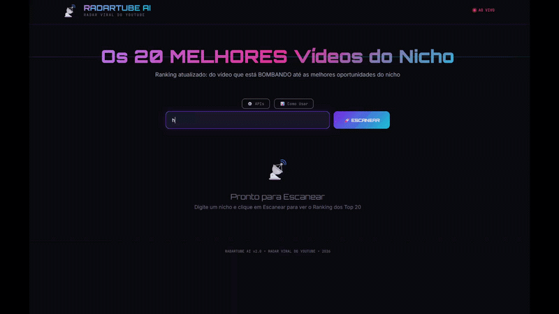
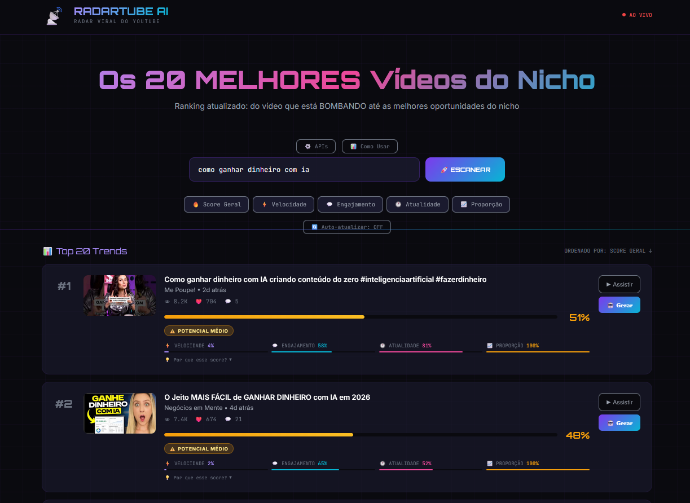
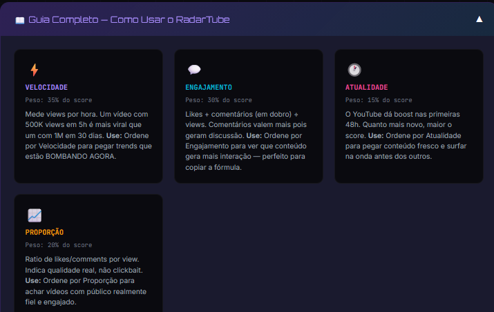
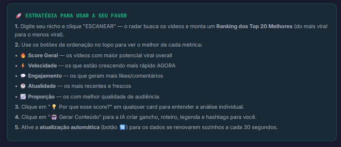
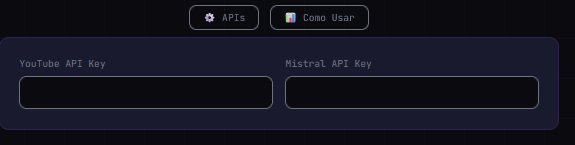

# 📡 RadarTube AI - YouTube Viral Intelligence System


🚀 Live Demo: https://rodrigoxai.github.io/-RadarTube-AI-v2.0---Youtube-Viral-Intelligence-System-/

## 🎥 Demo




🌎 Language
🇺🇸 English
🇧🇷 Português

**Find the top 20 videos in your niche and generate viral content using Artificial Intelligence.**

---

## 🚀 About the Project

RadarTube AI is an intelligence tool for content creators that analyzes the YouTube algorithm in real time. It doesn’t just show trends — it calculates a **Viral Score** based on growth speed, engagement, freshness, and audience quality, helping you ride the wave before everyone else.

---

## ✨ Main Features

- 🔍 **Viral Radar**: Scans the 50 most relevant videos in a niche and ranks the top 20.
- 📊 **Exclusive Viral Score** based on:
  - ⚡ Speed: Views per hour (explosive growth)
  - 💬 Engagement: Real audience interaction
  - 🕐 Freshness: Bonus for recent content (48h window)
  - 📈 Ratio: Audience quality vs. clicks
- 🤖 **AI Content Generator**: Hooks, scripts, captions, and hashtags powered by Mistral AI
- 🔄 **Real-time Monitoring**: Auto-refresh so you never miss a trend
- 🌗 **Futuristic Interface**: Responsive dark mode for Desktop and Mobile

---

## 🛠️ Technologies Used

- Frontend: HTML5, CSS3, JavaScript (ES6+)
- APIs:
  - YouTube Data API v3
  - Mistral AI (Small Latest model)
- Architecture: Lightweight Single Page Application (SPA), no complex backend required

---

## 📦 How to Use

### 1. Requirements

You will need two free API keys:

- YouTube Data API Key (Google Cloud Console)
- Mistral API Key (Mistral AI)

### 2. Installation

bash
git clone https://github.com/YOUR_USER/radartube.git
cd radartube

3. Run

Open radartube.html in your browser.

4. Configuration
Click the ⚙️ APIs button
Paste your keys
Click SCAN
🧠 Understanding the Viral Score
Metric	Weight	Description
⚡ Speed	35%	Detects fast-growing videos
💬 Engagement	30%	(Likes + 2× Comments) / Views
📈 Ratio	20%	Audience quality vs. clickbait
🕐 Freshness	15%	YouTube favors new content

💡 Pro Tip: Sort by Speed to see what’s exploding now, or by Engagement to learn what audiences love.

## 🤝 Contributing
Feel free to open Issues and Pull Requests. Any help to improve the algorithm or the interface is welcome!

## 📄 License
Made with 💜 by RodrigoXai


_______________________________________________________________________________________________________________________________________

>> PT BR <<

> **Encontre os 20 melhores vídeos do seu nicho e gere conteúdo viral com Inteligência Artificial.**

## 🚀 Sobre o Projeto
O **RadarTube AI** é uma ferramenta de inteligência para criadores de conteúdo que analisa o algoritmo do YouTube em tempo real. Ele não apenas mostra tendências, mas calcula um **Score Viral** baseado em velocidade de crescimento, engajamento e atualidade, ajudando você a surfar a onda antes dos outros.

## ✨ Funcionalidades Principais

- 🔍 **Radar Viral**: Busca os 50 vídeos mais relevantes de um nicho e apresenta um ranking dos 20 melhores.
- 📊 **Score Viral Exclusivo**: Algoritmo proprietário que analisa:
  - ⚡ **Velocidade**: Views por hora (crescimento explosivo).
  - 💬 **Engajamento**: Interação real do público.
  - 🕐 **Atualidade**: Bônus para conteúdo recente (janela de 48h).
  - 📈 **Proporção**: Qualidade da audiência vs. clicks.
- 🤖 **Gerador de Conteúdo com IA**: Cria ganchos, roteiros, legendas e hashtags usando Mistral AI.
- 🔄 **Monitoramento em Tempo Real**: Auto-atualização dos dados para você nunca perder uma trend.
- 🌗 **Interface Futurista**: Design Dark Mode responsivo para Desktop e Mobile.

## 🛠️ Tecnologias Utilizadas

- **Frontend**: HTML5, CSS3 (Moderno com Variáveis), JavaScript (ES6+).
- **APIs**:
  - 🟥 YouTube Data API v3
  - 🟧 Mistral AI (Modelo Small Latest)
- **Arquitetura**: Single Page Application (SPA) leve, sem necessidade de backend complexo.

## 📦 Como Usar

### 1. Pré-requisitos
Você precisará de duas chaves de API (gratuitas):
1.  **YouTube Data API Key**: [Obter no Google Cloud Console](https://console.cloud.google.com/)
2.  **Mistral API Key**: [Obter na Mistral AI](https://console.mistral.ai/)

### 2. Instalação
Não é necessário instalar nada. Basta fazer o download ou clonar o repositório:

```bash
git clone https://github.com/SEU_USUARIO/radartube.git
cd radartube
```

### 3. Execução
Abra o arquivo `radartube.html` no seu navegador preferido (Chrome, Edge, Firefox).

### 4. Configuração
1.  Clique no botão **"⚙️ APIs"** no topo.
2.  Cole suas chaves nos campos indicados.
3.  Clique em **"ESCANEAR"** e comece a analisar.

## 🧠 Entendendo o Score Viral

O RadarTube usa uma fórmula ponderada para classificar os vídeos:

| Métrica | Peso | Descrição |
| :--- | :---: | :--- |
| **⚡ Velocidade** | 35% | Detecta vídeos que estão ganhando views muito rápido (Viralidade instantânea). |
| **💬 Engajamento** | 30% | Mede a interação (Likes + 2x Comentários) em relação às views. |
| **📈 Proporção** | 20% | Indica se o vídeo é "clickbait" ou se tem qualidade real de retenção. |
| **🕐 Atualidade** | 15% | O algoritmo do YouTube favorece vídeos novos (frescor). |

> 💡 **Dica Pro:** Ordene por **Velocidade** para ver o que está bombando *agora*, ou por **Engajamento** para entender qual *tipo* de conteúdo o público mais gosta.

## 📸 Screenshots
*## 📸 Screenshots

### Home


### Guia


### Estratégia


### API



## 🤝 Contribuindo
Sinta-se livre para abrir Issues e Pull Requests. Toda ajuda para melhorar o algoritmo ou a interface é bem-vinda!

## 📄 Licença
Feito com 💜 por RodrigoXai ## MIT License


